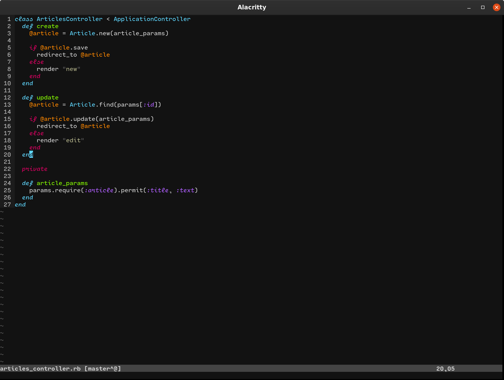

# molokai-italic

__FONT__: Cartograph CF | 
__TERM__: Alacritty

> Molokai is a Vim port of the monokai theme for TextMate originally created by
> Wimer Hazenberg. 
>
> 256-Color terminals are also supported, though there are some differences with
> the Gui version. Only the dark gray background style is supported on terminal
> vim at this time.

This is a fork of [fatih/molokai](https://github.com/fatih/molokai) with the following changes:

* `Comment` color style is changed to `italic`
* `Statement` color style is changed to `italic`
* `Conditional` color style is changed to `italic`
* `Constant` color style is changed to `italic`

## Installation

Use a plugin manager, i.e:

* [vim-plug](https://github.com/junegunn/vim-plug)
  * `Plug 'alirezabashyri/molokai-italic'`

or copy the file on your .vim/colors folder.
